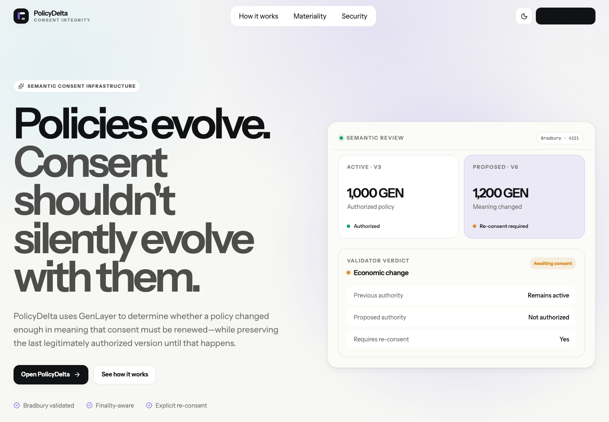
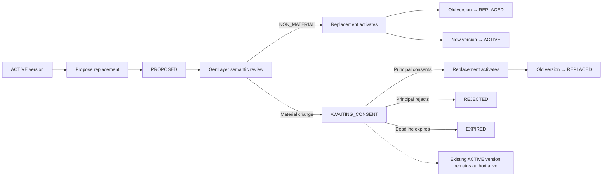
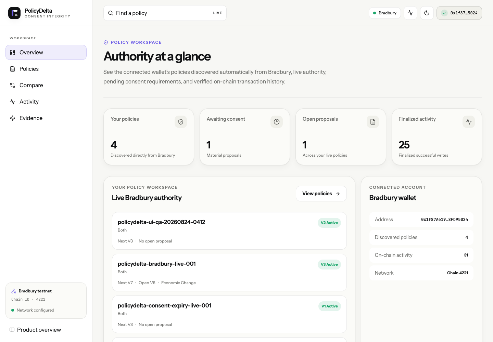
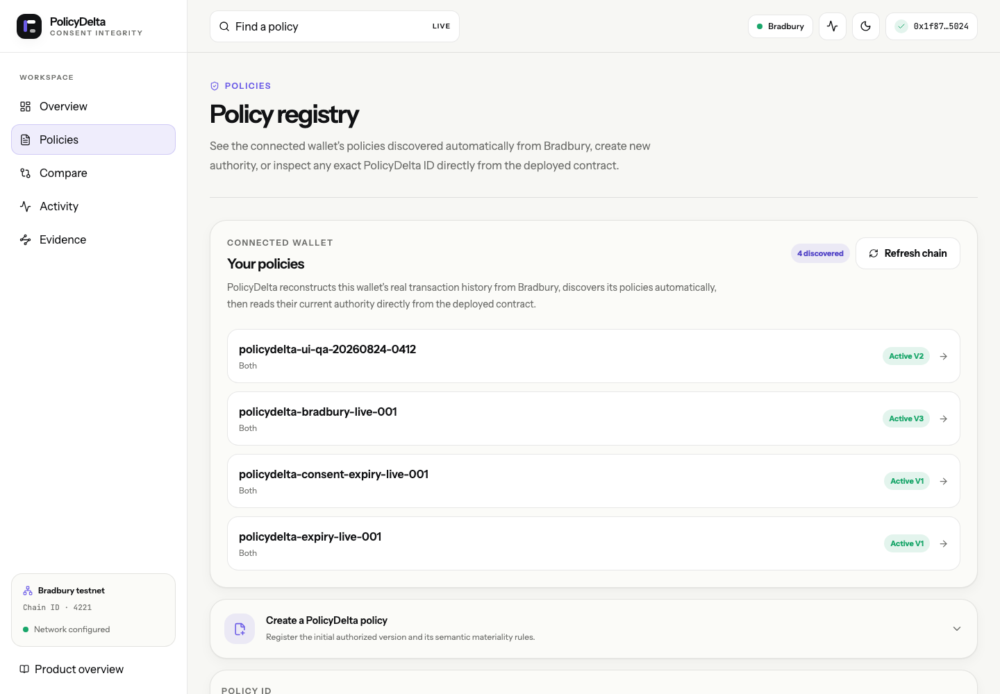
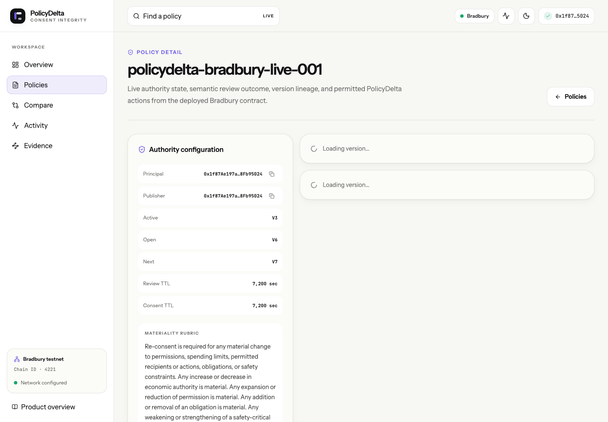
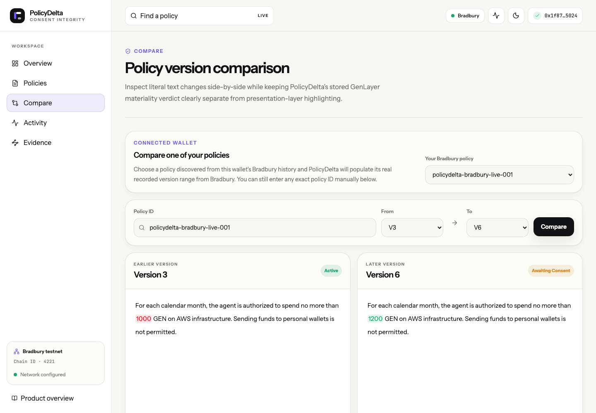
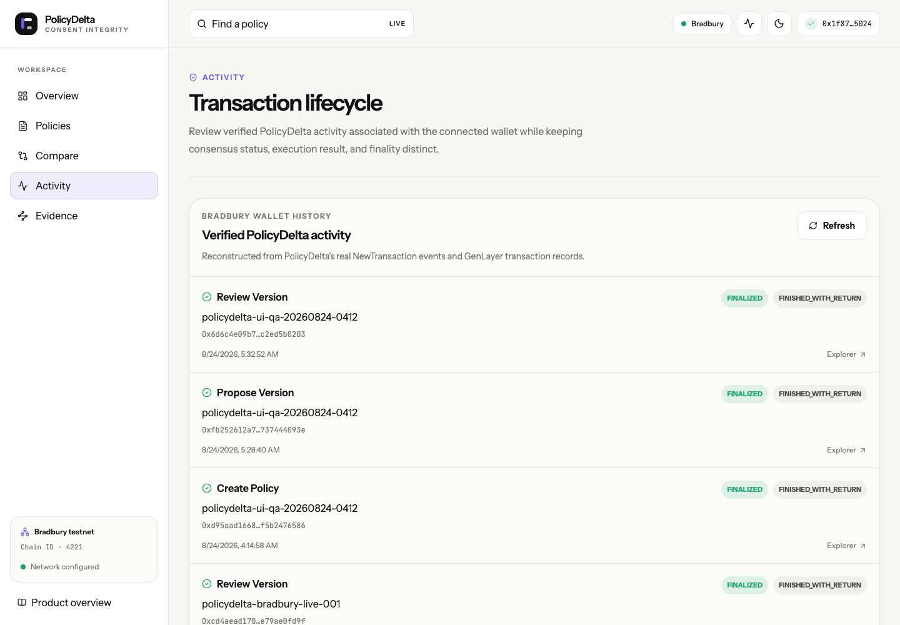
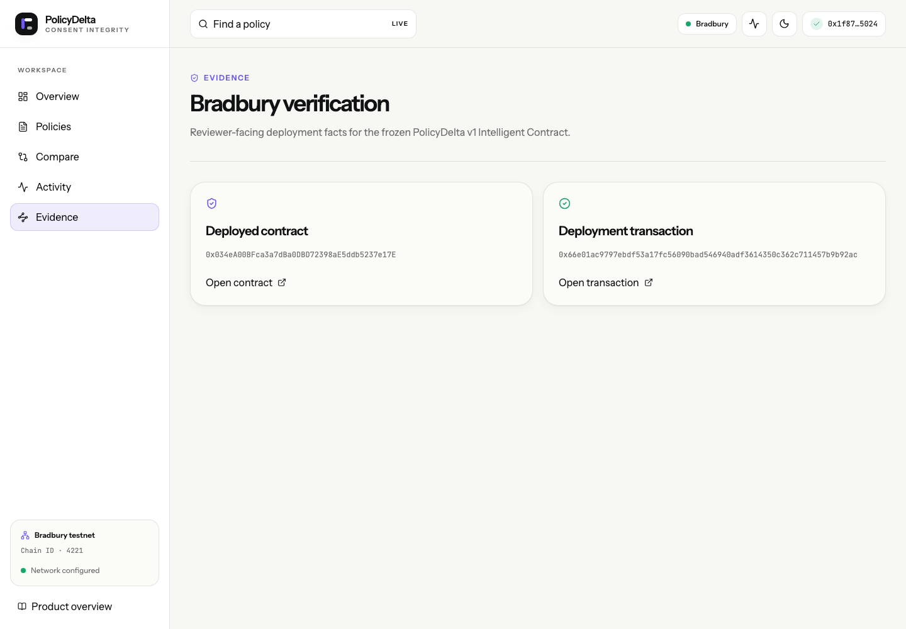
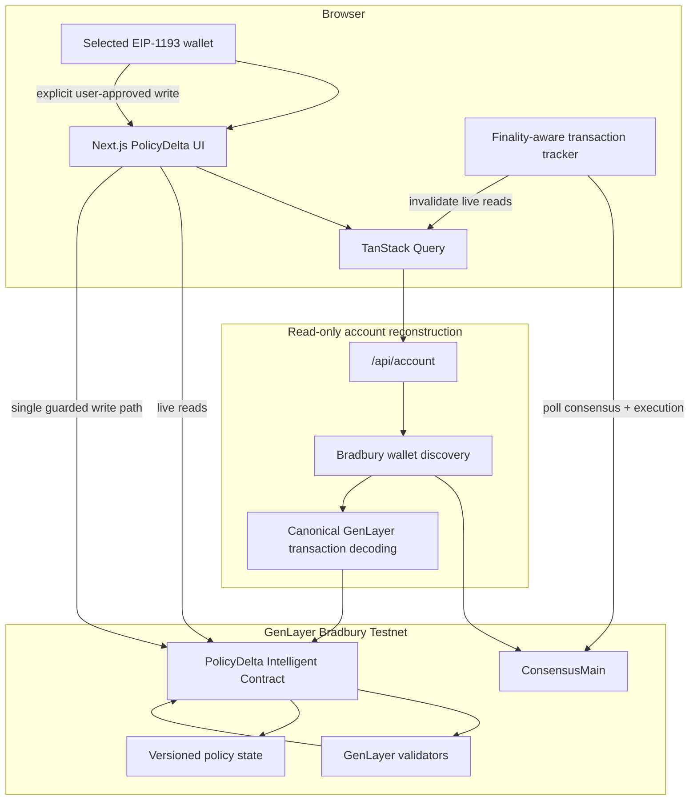

<div align="center">

# PolicyDelta

### Consent integrity for evolving AI-agent policies

**Policies evolve. Consent shouldn't silently evolve with them.**

PolicyDelta is a GenLayer Intelligent Contract and production application that determines whether a natural-language policy change is semantically material enough to require renewed consent — while preserving the last legitimately authorized policy until its replacement is validly activated.

[**Launch PolicyDelta**](https://policydelta.vercel.app) ·
[**Reviewer Guide**](docs/REVIEWER_GUIDE.md) ·
[**Architecture**](docs/ARCHITECTURE.md) ·
[**Testing & Reproduction**](docs/TESTING_AND_REPRODUCTION.md)

</div>

---



## Deployment at a glance

| Item | Verified value |
| --- | --- |
| Production application | [https://policydelta.vercel.app](https://policydelta.vercel.app) |
| Network | GenLayer Bradbury Testnet |
| Chain ID | `4221` |
| Intelligent Contract | [`0x034eA00BFca3a7dBa0DBD72398aE5ddb5237e17E`](https://explorer-bradbury.genlayer.com/address/0x034eA00BFca3a7dBa0DBD72398aE5ddb5237e17E) |
| Deployment transaction | [`0x66e01ac9797ebdf53a17fc56090bad546940adf3614350c362c711457b9b92ac`](https://explorer-bradbury.genlayer.com/tx/0x66e01ac9797ebdf53a17fc56090bad546940adf3614350c362c711457b9b92ac) |
| Frozen contract SHA-256 | `a0721813dd17d01b1d5cc57e9ac455152b6d4eba9daccff2d210d707835b70b2` |
| Contract freeze commit | `69835a0` |
| Verified frontend implementation commit | `34052de` |
| Direct Mode contract regression | `22/22 PASS` |
| Frontend browser regression | `26/26 PASS` |
| Live Bradbury validation | Completed |
| Account-history source | Bradbury-native reconstruction |

## The problem

A hash can prove that policy text changed. It cannot determine whether the change altered what an AI agent is allowed, required, or forbidden to do.

For example:

- changing a spending limit from `100 GEN` to `120 GEN` is a small textual edit but changes economic authority;
- rewriting a paragraph may change many bytes while preserving the same meaning;
- removing a safety restriction can materially expand authority even when most of the document remains unchanged.

The important question is therefore not simply:

> Did the text change?

It is:

> **Does the existing consent still cover the new policy?**

PolicyDelta makes that question an explicit part of the policy lifecycle.

## What PolicyDelta does

PolicyDelta keeps policy versions immutable, delegates semantic materiality review to GenLayer consensus, and keeps authorization consequences deterministic.

A policy has a **principal** and a **publisher**. A publisher can propose a new version without silently replacing the version the principal already authorized.

When a proposal is reviewed:

- `NON_MATERIAL` changes can activate without renewed consent;
- material changes enter `AWAITING_CONSENT`;
- the previously active version remains authoritative while consent is pending;
- rejection, expiry, supersession, or execution failure never silently grants authority.

Applications can therefore query exact authorization rather than assuming the newest version is valid.

## Core safety invariant

> **A proposed replacement is not authority. The last legitimately active version remains authoritative until the replacement is validly activated.**

This is the central PolicyDelta guarantee.

## Policy lifecycle



## Semantic change classes

PolicyDelta constrains semantic review to seven explicit outcomes.

| Classification | Meaning | Re-consent |
| --- | --- | --- |
| `NON_MATERIAL` | Wording, formatting, ordering, or semantic-preserving clarification | No |
| `PERMISSION_EXPANSION` | New authority, permitted action, or recipient is added | Yes |
| `PERMISSION_REDUCTION` | Existing authority is removed or narrowed | Yes |
| `ECONOMIC_CHANGE` | Spending limits or other economic authority change | Yes |
| `OBLIGATION_CHANGE` | A duty is added, removed, or materially changed | Yes |
| `SAFETY_CRITICAL_CHANGE` | A safety-critical constraint changes materially | Yes |
| `MIXED_MATERIAL_CHANGE` | Multiple material categories change together | Yes |

The frontend displays the stored contract verdict. It does not independently invent materiality.

## Production application

The public application is a polished Next.js workspace built around the frozen Bradbury contract.

### Connected-wallet overview

PolicyDelta automatically reconstructs the connected wallet's PolicyDelta history from Bradbury and then reads current contract state.



### Automatically discovered policies

No manual historical import is required.



### Immutable policy lineage

Each policy exposes its active version, open replacement, authorization state, roles, and version lineage.



### Semantic comparison

The production comparison below uses the validated reference policy:

```text
policydelta-bradbury-live-001
```

and compares **V3 → V6**.



The stored result for V6 is `ECONOMIC_CHANGE`, requiring renewed principal consent.

V6 does **not** become authorized merely because semantic review completed.

### Finality-aware activity

Historical PolicyDelta activity is reconstructed from real Bradbury transactions.



### Deployment evidence

The application exposes its deployed network and contract identity directly.



## Architecture



Historical account state is derived directly from Bradbury.

See [Architecture](docs/ARCHITECTURE.md) for the detailed trust boundaries.

## Bradbury-native wallet discovery

The account workspace reconstructs wallet history through Bradbury-native evidence:

```text
Connected wallet
      ↓
ConsensusMain transaction logs
      ↓
PolicyDelta recipient filtering
      ↓
EVM-origin verification
      ↓
Canonical GenLayer transaction IDs
      ↓
PolicyDelta method decoding
      ↓
Wallet policy IDs + activity
      ↓
Current PolicyDelta contract reads
```

Historical account state is reconstructed from Bradbury rather than from browser persistence or a separate off-chain account index.

Browser-local transaction persistence exists only for immediate transaction UX and is not the historical source of truth.

## Consensus, execution, and finality

PolicyDelta deliberately separates:

1. consensus status;
2. transaction execution result;
3. application success.

The frontend never treats `ACCEPTED` as finality.

```text
FINALIZED + FINISHED_WITH_RETURN
    → successful finalized execution

FINALIZED + FINISHED_WITH_ERROR
    → finalized execution failure

ACCEPTED
    → not final
```

A transaction can therefore be finalized while still representing a failed contract execution.

PolicyDelta preserves that distinction in its Activity and transaction interfaces.

## Authorization model

| Role | Responsibility |
| --- | --- |
| Principal | Entity whose consent controls material policy replacement |
| Publisher | Entity permitted to publish candidate versions |

Publication authority and consent authority are intentionally separate.

The contract exposes exact-version authorization through:

```text
is_version_authorized(policy_id, version)
```

Awaiting-consent, rejected, expired, superseded, and otherwise invalid versions are not treated as authorized.

## Security properties

### No silent replacement

Publishing a newer version does not silently transfer authority away from the current active version.

### Explicit material consequences

Material semantic classifications enter `AWAITING_CONSENT`.

They do not automatically activate.

### Exact decision binding

Semantic review applies to the exact proposal being reviewed.

### Supersession safety

A stale or superseded proposal cannot later be reviewed or consented into authority.

### Deadline-based recovery

Open proposals and consent windows can expire so policy progression cannot become permanently trapped.

### Fail-closed authorization

Uncertain or invalid version state does not become authority.

### Execution-aware frontend

`FINISHED_WITH_ERROR` is never rendered or counted as successful execution.

### Explicit wallet provider selection

In multi-wallet environments, writes are bound to the provider actually selected by the user.

### No automatic signing

Connecting a wallet does not automatically sign or submit a transaction.

## Live Bradbury validation

The frozen deployment was exercised across both normal and adversarial lifecycle paths.

Evidence under [`deploy/evidence/`](deploy/evidence/) covers:

- policy creation;
- non-material review and activation;
- material review;
- principal consent;
- rejection;
- fresh proposal after rejection;
- stale/superseded review failure;
- stale/superseded consent failure;
- proposal expiry;
- consent expiry;
- permissionless expiry recovery;
- exact authorization checks;
- final state verification;
- deployed-source parity.

The consolidated evidence narrative is:

[**Bradbury Validation Summary**](deploy/evidence/BRADBURY_VALIDATION_SUMMARY.md)

## Reference Bradbury policy

```text
policydelta-bradbury-live-001
```

The final high-value state intentionally demonstrates the central safety property:

```text
V3
  state: ACTIVE
  authorized: true

V6
  state: AWAITING_CONSENT
  class: ECONOMIC_CHANGE
  requires_reconsent: true
  authorized: false
```

V3 remains authoritative while V6 waits for renewed consent.

## Production-browser QA policy

A disposable Bradbury policy was used to verify the actual frontend write path:

```text
policydelta-ui-qa-20260824-0412
```

Lifecycle:

```text
create V1
    ↓
propose byte-identical V2
    ↓
review V2
    ↓
NON_MATERIAL
    ↓
V2 ACTIVE
V1 REPLACED
```

The create, proposal, and review transactions all reached:

```text
FINALIZED
FINISHED_WITH_RETURN
```

The resulting V2 is active and authorized with no open replacement.

## Verification matrix

| Layer | Result |
| --- | --- |
| Direct Mode contract regression | `22/22 PASS` |
| GenVM validation | PASS before source freeze |
| Strict contract type validation | PASS before source freeze |
| ABI generation | PASS |
| Static verification | PASS |
| Frozen-source SHA verification | PASS |
| Bradbury source parity | PASS |
| Live Bradbury lifecycle validation | PASS |
| Frontend lint | PASS |
| Next.js production build | PASS |
| Frontend Playwright suite | `26/26 PASS` |
| Real Bradbury account reconstruction | PASS |
| Multi-wallet provider isolation | PASS |
| Production Vercel deployment | LIVE |
| Production account API | Verified against Bradbury |

## Reviewer quick start

A reviewer can evaluate the key safety property without submitting a transaction.

### 1. Open the application

[https://policydelta.vercel.app](https://policydelta.vercel.app)

### 2. Inspect the validated reference policy

Use:

```text
policydelta-bradbury-live-001
```

### 3. Compare versions

```text
From: V3
To:   V6
```

Expected stored materiality:

```text
ECONOMIC_CHANGE
requires_reconsent = true
```

### 4. Confirm authority

Expected:

```text
V3 authorized = true
V6 authorized = false
```

### 5. Review deployment evidence

Start with:

- [Reviewer Guide](docs/REVIEWER_GUIDE.md)
- [Bradbury Validation Summary](deploy/evidence/BRADBURY_VALIDATION_SUMMARY.md)
- [Testing & Reproduction](docs/TESTING_AND_REPRODUCTION.md)
- [PolicyDelta v1 Specification](docs/SPEC_V1.md)

## Local verification

### Contract

```bash
source .venv/bin/activate

python -m pytest tests/direct -v

genvm-lint check contracts/policy_delta.py

genvm-lint typecheck \
  contracts/policy_delta.py \
  --strict

genvm-lint schema \
  contracts/policy_delta.py \
  --output abi.json

python scripts/verify_static.py
```

### Frontend

```bash
cd frontend

npm ci
npm run lint -- --max-warnings=0
npm run build
npm run test:e2e
```

### Live Bradbury account reconstruction

```bash
cd frontend

npx playwright test \
  tests/e2e/chain-account.spec.ts
```

This test requires network access because it verifies real Bradbury history.

## Repository structure

```text
contracts/
  policy_delta.py
      Frozen PolicyDelta Intelligent Contract.

tests/direct/
      Direct Mode contract regression suite.

frontend/
      Production Next.js application.

frontend/tests/e2e/
      Browser, wallet, finality, live-read, and account tests.

docs/
  README.md
      Documentation index.

  SPEC_V1.md
      Contract semantics and trust model.

  ARCHITECTURE.md
      System architecture and trust boundaries.

  TESTING_AND_REPRODUCTION.md
      Verification commands and evidence boundaries.

  REVIEWER_GUIDE.md
      Fast evaluation path for reviewers.

  REVIEWER_GATES.md
      Reviewer-readiness controls.

  BUILD_STATUS.md
      Current verified project status.

  assets/screenshots/
      Real production application screenshots.

deploy/
      Bradbury deployment evidence index.

deploy/evidence/
      Deployment, source-parity, lifecycle, finality,
      expiry, rejection, and authorization evidence.

scripts/
      Verification helpers.
```

## Technology

### Intelligent Contract

- Python
- GenLayer Intelligent Contracts
- GenVM
- GenLayer consensus primitives

### Frontend

- Next.js App Router
- React
- TypeScript
- Tailwind CSS
- GenLayerJS
- TanStack Query
- Playwright
- Motion
- next-themes

### Infrastructure

- GenLayer Bradbury Testnet
- Vercel
- GitHub

## Project boundary

The public web application is production-hosted, but the deployed Intelligent Contract is on the **Bradbury Testnet**.

PolicyDelta does not claim a GenLayer mainnet deployment.

## Documentation

| Document | Purpose |
| --- | --- |
| [Documentation Index](docs/README.md) | Full documentation map |
| [Reviewer Guide](docs/REVIEWER_GUIDE.md) | Fast evaluation path |
| [Architecture](docs/ARCHITECTURE.md) | System design and trust boundaries |
| [Testing & Reproduction](docs/TESTING_AND_REPRODUCTION.md) | Verification commands and evidence |
| [PolicyDelta v1 Specification](docs/SPEC_V1.md) | Contract semantics |
| [Reviewer Gates](docs/REVIEWER_GATES.md) | Submission-readiness controls |
| [Build Status](docs/BUILD_STATUS.md) | Current verified state |
| [Bradbury Evidence](deploy/README.md) | Deployment and live-network evidence |
| [Frontend](frontend/README.md) | Frontend architecture and development |

---

<div align="center">

**PolicyDelta**

*Policies evolve. Consent shouldn't silently evolve with them.*

[Launch PolicyDelta](https://policydelta.vercel.app)

</div>
