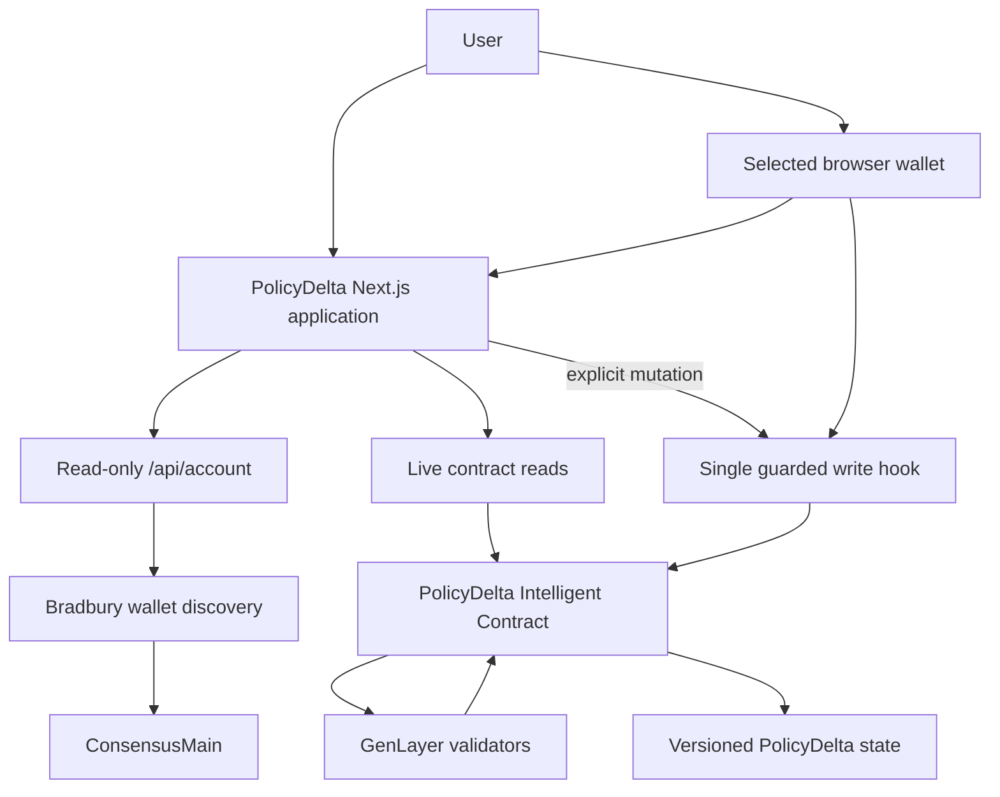
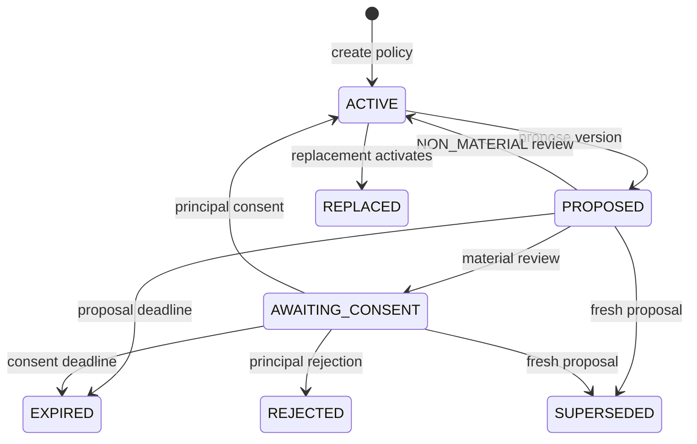
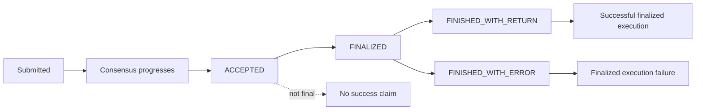
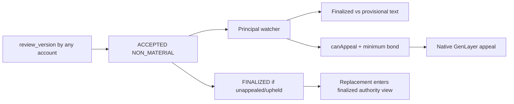

# PolicyDelta Architecture

## Purpose

PolicyDelta separates four concerns that are often incorrectly collapsed together:

1. publishing a policy revision;
2. judging semantic materiality;
3. giving renewed consent;
4. deciding exact authorization.

The architectural goal is simple:

> A new policy version must never silently inherit authority merely because it exists or because validators reviewed it.

## Deployment identity

| Item | Value |
| --- | --- |
| Network | GenLayer Bradbury Testnet |
| Chain ID | `4221` |
| Contract | `0x034eA00BFca3a7dBa0DBD72398aE5ddb5237e17E` |
| Frozen SHA-256 | `a0721813dd17d01b1d5cc57e9ac455152b6d4eba9daccff2d210d707835b70b2` |
| Production application | `https://policydelta.vercel.app` |

## System overview



## Trust boundaries

### Semantic judgment

Natural-language materiality is the nondeterministic question.

PolicyDelta delegates that judgment to GenLayer consensus rather than a private application backend.

### Deterministic consequences

The semantic verdict does not directly become authority.

Contract logic determines whether the reviewed version:

- activates;
- waits for consent;
- remains unauthorized;
- expires;
- is rejected;
- is superseded.

### Principal consent

Material versions enter:

```text
AWAITING_CONSENT
```

Only valid principal consent can activate that replacement.

### Browser wallet

The wallet is an external provider boundary.

PolicyDelta:

- discovers injected providers;
- preserves explicit provider selection;
- reads account/network state;
- re-checks account and chain immediately before writes;
- never automatically signs when the wallet merely connects.

## Contract state model



## Authorization invariant

The newest policy version is not automatically the authorized policy version.

Applications should ask:

```text
is_version_authorized(policy_id, version)
```

rather than inferring authority from version ordering.

Fail-closed states include:

- `AWAITING_CONSENT`;
- `REJECTED`;
- `EXPIRED`;
- `SUPERSEDED`;
- `REPLACED` when no longer current.

## Materiality boundary

The semantic output is constrained to:

```text
NON_MATERIAL
PERMISSION_EXPANSION
PERMISSION_REDUCTION
ECONOMIC_CHANGE
OBLIGATION_CHANGE
SAFETY_CRITICAL_CHANGE
MIXED_MATERIAL_CHANGE
```

Only `NON_MATERIAL` can activate without renewed principal consent.

## Chain-native wallet discovery

PolicyDelta derives historical account state directly from Bradbury.

Wallet history is reconstructed from Bradbury.

```text
ConsensusMain transaction logs
            ↓
PolicyDelta recipient filtering
            ↓
EVM wallet-origin verification
            ↓
Canonical GenLayer transaction ID
            ↓
GenLayer transaction decoding
            ↓
PolicyDelta method + policy ID
            ↓
Current PolicyDelta contract state
```

## Why both chain layers are checked

A Bradbury transaction has both chain-side creation evidence and a canonical GenLayer transaction identity.

The account reconstruction path verifies enough information to avoid presenting unrelated transactions as PolicyDelta activity:

1. transaction origin;
2. PolicyDelta recipient;
3. canonical GenLayer transaction;
4. decoded PolicyDelta method;
5. policy identifier.

## Account API

The account endpoint is read-only:

```text
frontend/src/app/api/account/route.ts
```

Discovery implementation:

```text
frontend/src/lib/account/chain-discovery.ts
```

The route reconstructs:

- wallet policies;
- principal/publisher role;
- verified PolicyDelta activity;
- consensus status;
- execution result;
- chain timestamp.

## Chain-derived account state

The authoritative account path is:

```text
wallet
  → Bradbury history
  → canonical PolicyDelta transaction decoding
  → current contract state
```

The application does not maintain a competing historical account index.

## Read path

Contract reads use the Bradbury GenLayer client.

PolicyDelta uses two deliberately separate state views:

```text
LATEST_FINAL
  → policy cards
  → active version
  → exact authorization
  → enforcement-facing authority

LATEST_NONFINAL
  → accepted review surveillance only
  → provisional old/new comparison
  → appeal eligibility and bond
```

The non-final view is never passed to `is_version_authorized` consumers as settled authority.

Important read operations include:

- policy;
- version;
- lineage;
- exact authorization.

The UI renders contract truth rather than maintaining an independent policy state machine.

## Write path

All PolicyDelta application writes are centralized through:

```text
frontend/src/hooks/use-policy-write.ts
```

This prevents individual screens from creating independent signing pipelines.

## Finality model



For an automatic `NON_MATERIAL` review, the accepted transaction can contain a provisional active version before finality. PolicyDelta therefore keeps the prior finalized version authoritative in the application while independently surfacing the provisional result to the principal.



Discovery is policy-centric rather than submitter-centric: a permissionless review appears in the affected principal's activity and appeal center even when the principal did not originate it.

PolicyDelta therefore does not equate:

```text
ACCEPTED = FINALIZED
```

and does not equate:

```text
FINALIZED = successful execution
```

Successful completion requires the execution result to agree.

## Query refresh model

Transaction progress invalidates relevant TanStack Query state.

```text
transaction changes
      ↓
relevant query invalidated
      ↓
live Bradbury state read again
      ↓
UI refreshes
```

The browser never becomes the source of truth.

## Local transaction persistence

The transaction center can persist recent transaction references for UX continuity across refreshes.

That persistence is:

- bounded;
- non-authoritative;
- unrelated to historical account reconstruction.

## Failure handling

PolicyDelta fails closed for:

- rejected replacements;
- expired proposals;
- expired consent windows;
- superseded proposals;
- stale review attempts;
- stale consent attempts;
- execution failures.

The existence of a transaction is never sufficient evidence of authorization.

## Related documentation

- [`../README.md`](../README.md)
- [`REVIEWER_GUIDE.md`](REVIEWER_GUIDE.md)
- [`TESTING_AND_REPRODUCTION.md`](TESTING_AND_REPRODUCTION.md)
- [`SPEC_V1.md`](SPEC_V1.md)
- [`../deploy/README.md`](../deploy/README.md)
